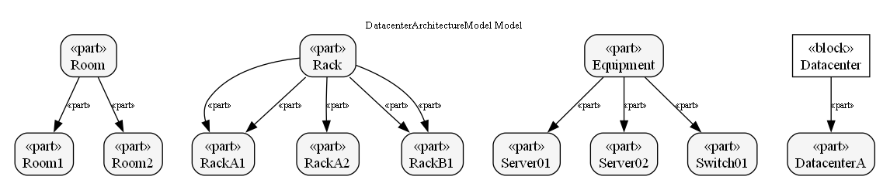
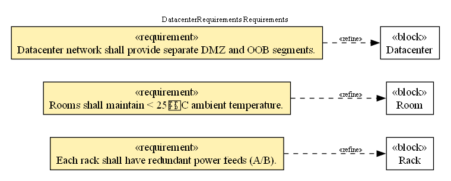
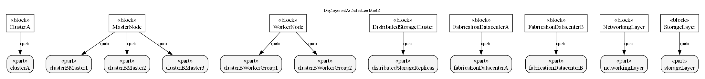
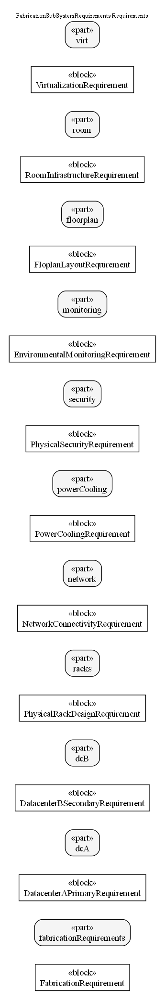
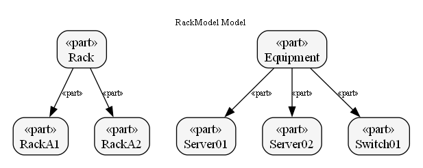

# DatacenterArchitectureModel

Generated: 2025-12-04

## Block definition diagram

# DatacenterRequirements

Generated: 2025-12-04

## Requirement diagram

# DeploymentArchitecture

Generated: 2025-12-04

## Block definition diagram

# FabricationSubSystemRequirements

Generated: 2025-12-04

## Requirement diagram

# PowerCoolingInterfaces

Generated: 2025-12-04

## Interface diagram

# RackModel

Generated: 2025-12-04

## Block definition diagram

# RoomModel

Generated: 2025-12-04

## Block definition diagram

